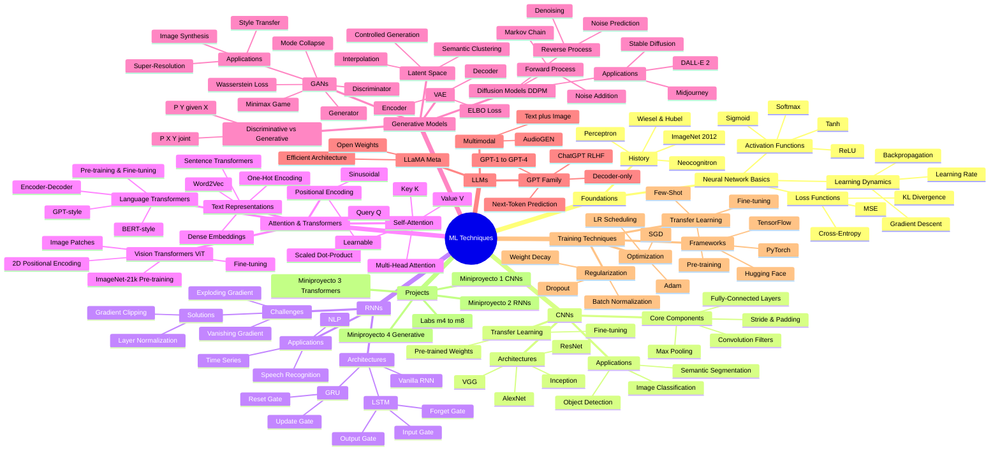

# ML Techniques — Mermaid Mind Map

Paste the block below into any Mermaid renderer (mermaid.live, VS Code Mermaid extension, etc.).

```mermaid
mindmap
  root((ML Techniques))
    Foundations
      History
        Wiesel & Hubel
        Neocognitron
        Perceptron
        ImageNet 2012
      Neural Network Basics
        Activation Functions
          ReLU
          Sigmoid
          Tanh
          Softmax
        Learning Dynamics
          Backpropagation
          Gradient Descent
          Learning Rate
        Loss Functions
          MSE
          Cross-Entropy
          KL Divergence
    CNNs
      Core Components
        Convolution Filters
        Stride & Padding
        Max Pooling
        Fully-Connected Layers
      Architectures
        AlexNet
        VGG
        ResNet
        Inception
      Applications
        Image Classification
        Object Detection
        Semantic Segmentation
      Transfer Learning
        Pre-trained Weights
        Fine-tuning
    RNNs
      Architectures
        Vanilla RNN
        LSTM
          Input Gate
          Forget Gate
          Output Gate
        GRU
          Update Gate
          Reset Gate
      Challenges
        Vanishing Gradient
        Exploding Gradient
        Solutions
          Gradient Clipping
          Layer Normalization
      Applications
        NLP
        Time Series
        Speech Recognition
    Attention & Transformers
      Self-Attention
        Query Q
        Key K
        Value V
        Multi-Head Attention
        Scaled Dot-Product
      Text Representations
        One-Hot Encoding
        Word2Vec
        Dense Embeddings
        Sentence Transformers
      Positional Encoding
        Sinusoidal
        Learnable
      Language Transformers
        Encoder-Decoder
        BERT-style
        GPT-style
        Pre-training & Fine-tuning
      Vision Transformers ViT
        Image Patches
        2D Positional Encoding
        ImageNet-21k Pre-training
        Fine-tuning
    Generative Models
      Discriminative vs Generative
        P Y given X
        P X Y joint
      Latent Space
        Semantic Clustering
        Interpolation
        Controlled Generation
      VAE
        Encoder
        Decoder
        ELBO Loss
      GANs
        Generator
        Discriminator
        Minimax Game
        Wasserstein Loss
        Mode Collapse
        Applications
          Image Synthesis
          Style Transfer
          Super-Resolution
      Diffusion Models DDPM
        Forward Process
          Noise Addition
          Markov Chain
        Reverse Process
          Denoising
          Noise Prediction
        Applications
          DALL-E 2
          Stable Diffusion
          Midjourney
    LLMs
      GPT Family
        Decoder-only
        Next-Token Prediction
        GPT-1 to GPT-4
        ChatGPT RLHF
      LLaMA Meta
        Efficient Architecture
        Open Weights
      Multimodal
        Text plus Image
        AudioGEN
    Training Techniques
      Optimization
        SGD
        Adam
        LR Scheduling
      Regularization
        Dropout
        Batch Normalization
        Weight Decay
      Transfer Learning
        Pre-training
        Fine-tuning
        Few-Shot
      Frameworks
        PyTorch
        TensorFlow
        Hugging Face
    Projects
      Miniproyecto 1 CNNs
      Miniproyecto 2 RNNs
      Miniproyecto 3 Transformers
      Miniproyecto 4 Generative
      Labs m4 to m8
```
